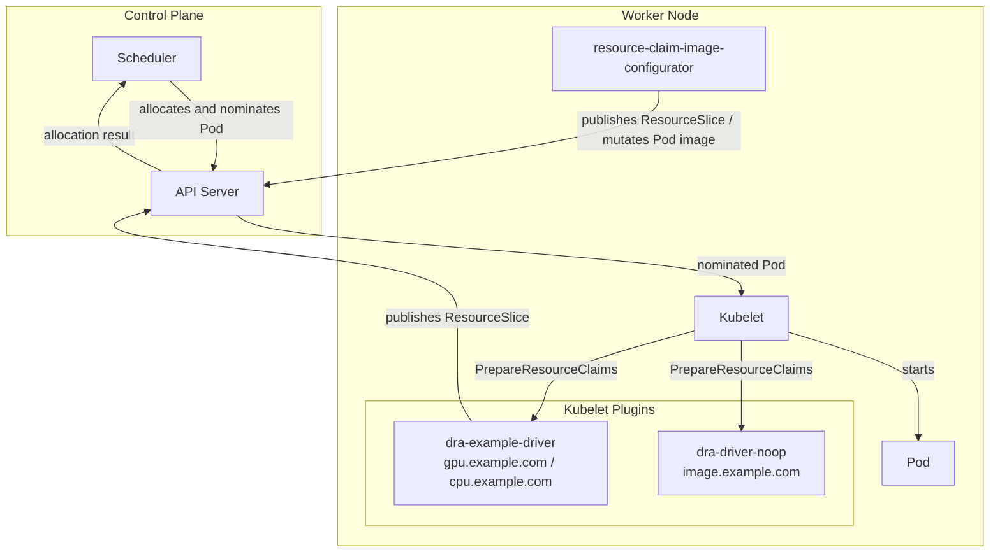

# resource-claim-image-configurator

Proof-of-concept controller demonstrating how DRA Device Binding Conditions (KEP-5007) can enable workload fungibility — allowing the runtime container image to be selected automatically based on which device the scheduler actually allocates.

## Motivation

Consider an inference service that scales horizontally. Each Pod prefers a GPU for performance, but when GPU supply is exhausted — whether due to cluster capacity limits or cloud provider quota — the service should continue scaling by falling back to CPU-based inference rather than failing. DRA's `firstAvailable` prioritized list handles the scheduling side of this: declare GPU as the first choice and CPU as the fallback, and the scheduler does the right thing automatically.

The missing piece is the container image. A GPU inference workload and a CPU inference workload require different images, but the scheduler's choice is only known at scheduling time — too late to set the image upfront. Something needs to observe the allocation result and mutate the Pod's image before the kubelet starts the container.

This controller solves that problem. It reads which subrequest was satisfied, mutates the container image accordingly, and lets the Pod proceed — with no operator intervention and no failed Pods.

See also: [KEP-5007 discussion](https://github.com/kubernetes/enhancements/pull/5487#discussion_r2382915417)

## How it works

The controller publishes a dedicated ResourceSlice for the `image.example.com` driver. This slice's device declares `bindingConditions: ["image-verified"]`, which causes the kubelet to block Pod startup until the condition is satisfied. Pods request this device alongside their actual compute device. When a Pod is pending, the controller reads the allocation result, determines which subrequest was chosen, mutates the container image, and then satisfies the binding condition to unblock the kubelet.

```
┌──────────────────────────────────────────────────────────┐
│ ResourceClaimTemplate                                    │
│                                                          │
│  requests:                                               │
│    device  (firstAvailable: gpu.example.com,             │
│                              cpu.example.com)            │
│    image-config (exactly: image.example.com)  ← gating   │
│                                                          │
│  config:                                                 │
│    device/gpu → image: fedora:latest                     │
│    device/cpu → image: ubuntu:latest                     │
└──────────────────────────────────────────────────────────┘
                         │
                  Pod is created
                         │
              Scheduler allocates devices
                         │
┌──────────────────────────────────────────────────────────┐
│ image-config device has BindingCondition "image-verified"│
│ → kubelet blocks Pod startup                             │
└──────────────────────────────────────────────────────────┘
                         │
        Controller detects pending condition
                         │
        Reads image config for the chosen subrequest
        (device/gpu or device/cpu)
                         │
        Mutates Pod.spec.containers[*].image
                         │
        Sets BindingCondition status: True
                         │
              kubelet starts the Pod
```

### Components



| Component | Role |
|---|---|
| **dra-example-driver** | Kubelet plugin for `gpu.example.com` and `cpu.example.com`. Publishes ResourceSlices with device attributes. No `BindingConditions` on these devices. |
| **[dra-driver-noop](https://github.com/gke-labs/dra-drivers/tree/main/dra-driver-noop)** | Kubelet plugin for `image.example.com`. Registers with the kubelet and returns success for all Prepare/Unprepare calls without doing anything. Required because the kubelet must have a registered plugin for each driver name that appears in an allocation result. |
| **resource-claim-image-configurator** (this controller) | Publishes a ResourceSlice for `image.example.com` with `bindingConditions: ["image-verified"]`. Watches Pods, mutates container images, and satisfies the binding condition. |

The `image.example.com` ResourceSlice exposes a single shared device (`image-configurator`) with `allowMultipleAllocations: true` and `bindsToNode: false`, so it can be claimed by any number of Pods across all nodes simultaneously.

> **Note:** The dra-driver-noop plugin may become unnecessary if [KEP-5945 (Optional Node Preparation)](https://github.com/kubernetes/enhancements/issues/5945) is implemented, which would allow DRA drivers to opt out of kubelet-side Prepare/Unprepare entirely.

## Prerequisites

- Kubernetes v1.34+ with feature gates `DynamicResourceAllocation` and `DRADeviceBindingConditions` enabled
- [dra-example-driver](https://github.com/kubernetes-sigs/dra-example-driver) deployed for `gpu.example.com` and `cpu.example.com`
- [dra-driver-noop](https://github.com/gke-labs/dra-drivers/tree/main/dra-driver-noop) deployed for `image.example.com`

## Setup

### 1. Deploy dra-example-driver

Follow the [dra-example-driver README](https://github.com/kubernetes-sigs/dra-example-driver) to deploy the driver twice — once for `gpu.example.com` and once for `cpu.example.com`. Each instance runs as a DaemonSet and creates a ResourceSlice per node.

Verify the ResourceSlices are present:

```bash
kubectl get resourceslice
```

Expected output (before deploying the controller):

```
NAME                                                            NODE                                DRIVER            POOL
00000-cpu.example.com-dra-example-driver-cluster-worker-xxxxx   dra-example-driver-cluster-worker   cpu.example.com   dra-example-driver-cluster-worker
00000-gpu.example.com-dra-example-driver-cluster-worker-xxxxx   dra-example-driver-cluster-worker   gpu.example.com   dra-example-driver-cluster-worker
```

<details>
<summary>Full ResourceSlice YAML (gpu.example.com and cpu.example.com)</summary>

```yaml
apiVersion: resource.k8s.io/v1
kind: ResourceSlice
metadata:
  creationTimestamp: "2026-05-27T05:54:59Z"
  generateName: 00000-cpu.example.com-dra-example-driver-cluster-worker-
  generation: 1
  name: 00000-cpu.example.com-dra-example-driver-cluster-worker-85vdc
  ownerReferences:
  - apiVersion: v1
    controller: true
    kind: Node
    name: dra-example-driver-cluster-worker
    uid: c436dc49-3913-436b-afb5-58fef7864f54
  resourceVersion: "289571"
  uid: 43df4aa9-56a4-450e-a174-a1fdb22f27bd
spec:
  devices:
  - attributes:
      driverVersion:
        version: 1.0.0
      index:
        int: 0
      model:
        string: LATEST-GPU-MODEL
      uuid:
        string: gpu-18db0e85-99e9-c746-8531-ffeb86328b39
    capacity:
      memory:
        value: 80Gi
    name: gpu-0
  driver: cpu.example.com
  nodeName: dra-example-driver-cluster-worker
  pool:
    generation: 1
    name: dra-example-driver-cluster-worker
    resourceSliceCount: 1
---
apiVersion: resource.k8s.io/v1
kind: ResourceSlice
metadata:
  creationTimestamp: "2026-05-27T05:54:59Z"
  generateName: 00000-gpu.example.com-dra-example-driver-cluster-worker-
  generation: 1
  name: 00000-gpu.example.com-dra-example-driver-cluster-worker-692rh
  ownerReferences:
  - apiVersion: v1
    controller: true
    kind: Node
    name: dra-example-driver-cluster-worker
    uid: c436dc49-3913-436b-afb5-58fef7864f54
  resourceVersion: "289572"
  uid: 471f07b7-fa68-4349-8118-d1e895ccafa5
spec:
  devices:
  - attributes:
      driverVersion:
        version: 1.0.0
      index:
        int: 0
      model:
        string: LATEST-GPU-MODEL
      uuid:
        string: gpu-18db0e85-99e9-c746-8531-ffeb86328b39
    capacity:
      memory:
        value: 80Gi
    name: gpu-0
  driver: gpu.example.com
  nodeName: dra-example-driver-cluster-worker
  pool:
    generation: 1
    name: dra-example-driver-cluster-worker
    resourceSliceCount: 1
```

</details>

### 2. Deploy dra-driver-noop

Deploy [dra-driver-noop](https://github.com/gke-labs/dra-drivers/tree/main/dra-driver-noop) as a kubelet plugin for `image.example.com`. This no-op driver registers with the kubelet and returns success for all Prepare/Unprepare gRPC calls without doing any actual work. It is required because the kubelet must have a registered plugin for every driver name that appears in an allocation result.

Follow the [dra-driver-noop README](https://github.com/gke-labs/dra-drivers/tree/main/dra-driver-noop) to deploy it with `driverNames: "image.example.com"`.

### 3. Deploy the controller

The controller publishes the `image.example.com` ResourceSlice and watches Pods for pending binding conditions.

```bash
kubectl apply -f deploy/daemonset.yaml
```

After startup, an additional ResourceSlice appears:

```
NAME                          NODE     DRIVER              POOL
00000-image.example.com-xxxxx  (none)   image.example.com   all-nodes
```

<details>
<summary>Full ResourceSlice YAML (image.example.com)</summary>

```yaml
apiVersion: resource.k8s.io/v1
kind: ResourceSlice
metadata:
  creationTimestamp: "2026-05-25T09:26:18Z"
  generateName: 00000-image.example.com-
  generation: 2
  name: 00000-image.example.com-6thzv
  resourceVersion: "171891"
  uid: dd31ab58-3e26-4de5-8e3e-244b6ee7c8c2
spec:
  allNodes: true
  devices:
  - allowMultipleAllocations: true
    bindingConditions:
    - image-verified
    bindingFailureConditions:
    - image-prepare-failed
    bindsToNode: false
    name: image-configurator
  driver: image.example.com
  pool:
    generation: 1
    name: all-nodes
    resourceSliceCount: 1
```

</details>

### 4. Apply the DeviceClass

```bash
kubectl apply -f deploy/deviceclass.yaml
```

This creates a `DeviceClass` named `image.example.com` that selects devices from the `image.example.com` driver.

## Usage

### Scenario 1: ImageConfig and BindingCondition in a single ResourceClaim

### 1. Create a ResourceClaimTemplate with a prioritized list

Use `firstAvailable` to specify a prioritized list of subrequests. The scheduler will try them in order and pick the first one that can be satisfied. Each subrequest references a different DeviceClass.

The template also declares an `image-config` request targeting `image.example.com`. This is the gating device that carries `BindingConditions`, blocking Pod startup until the controller has mutated the image.

The `config` section uses the `<main request>/<subrequest>` format to attach opaque parameters to each subrequest. The controller reads these parameters — typed as `ImageConfig` — to determine which image to set when the corresponding subrequest is chosen.

```yaml
apiVersion: resource.k8s.io/v1
kind: ResourceClaimTemplate
metadata:
  name: gpu-or-cpu
spec:
  spec:
    devices:
      requests:
        - name: device
          firstAvailable:
            - name: gpu
              deviceClassName: gpu.example.com
            - name: cpu
              deviceClassName: cpu.example.com
        - name: image-config
          exactly:
            deviceClassName: image.example.com
      config:
        - requests: ["device/gpu"]
          opaque:
            driver: image.example.com
            parameters:
              apiVersion: image.example.com/v1alpha1
              kind: ImageConfig
              containerName: app
              image: fedora:latest
        - requests: ["device/cpu"]
          opaque:
            driver: image.example.com
            parameters:
              apiVersion: image.example.com/v1alpha1
              kind: ImageConfig
              containerName: app
              image: ubuntu:latest
```

### 2. Create a Pod referencing the claim

```yaml
apiVersion: v1
kind: Pod
metadata:
  name: my-app-1
spec:
  terminationGracePeriodSeconds: 0
  containers:
    - name: app
      image: busybox:latest  # will be mutated by the controller
      imagePullPolicy: IfNotPresent
      command: ["sleep", "infinity"]
      resources:
        claims:
          - name: device
  resourceClaims:
    - name: device
      resourceClaimTemplateName: gpu-or-cpu
```

### 3. Verify the behavior

This scenario demonstrates the prioritized allocation and image mutation:

- The first Pod (`my-app-1`) is allocated a GPU device because `gpu.example.com` has the highest priority in `firstAvailable`. The controller reads the matching config and mutates the container image from `busybox:latest` to `fedora:latest`.
- The second Pod (`my-app-2`) cannot get a GPU because it is already occupied by `my-app-1`. The scheduler falls back to `cpu.example.com` via the prioritized list, and the controller mutates the container image from `busybox:latest` to `ubuntu:latest`.

**Step 1: Create the first Pod**

```bash
$ kubectl apply -f demo/scenario-1/pod-1.yaml
pod/my-app-1 created
```

**Step 2: Verify the first Pod is allocated the GPU**

The scheduler picks `gpu.example.com` (highest priority in `firstAvailable`):

```bash
$ kubectl get resourceclaim my-app-1-device-r8m2x -o jsonpath='{.status}' | jq .
```

<details>
<summary>Output</summary>

```json
{
  "allocation": {
    "allocationTimestamp": "2026-05-27T05:55:01Z",
    "devices": {
      "config": [
        {
          "opaque": {
            "driver": "image.example.com",
            "parameters": {
              "apiVersion": "image.example.com/v1alpha1",
              "containerName": "app",
              "image": "fedora:latest",
              "kind": "ImageConfig"
            }
          },
          "requests": ["device/gpu"],
          "source": "FromClaim"
        }
      ],
      "results": [
        {
          "device": "gpu-0",
          "driver": "gpu.example.com",
          "pool": "dra-example-driver-cluster-worker",
          "request": "device/gpu"
        },
        {
          "bindingConditions": ["image-verified"],
          "bindingFailureConditions": ["image-prepare-failed"],
          "device": "image-configurator",
          "driver": "image.example.com",
          "pool": "all-nodes",
          "request": "image-config"
        }
      ]
    },
    "nodeSelector": {
      "nodeSelectorTerms": [
        {
          "matchFields": [
            {
              "key": "metadata.name",
              "operator": "In",
              "values": ["dra-example-driver-cluster-worker"]
            }
          ]
        }
      ]
    }
  },
  "devices": [
    {
      "conditions": [
        {
          "lastTransitionTime": "2026-05-27T05:55:02Z",
          "message": "Container image has been updated",
          "reason": "ImagePatched",
          "status": "True",
          "type": "image-verified"
        }
      ],
      "device": "image-configurator",
      "driver": "image.example.com",
      "pool": "all-nodes"
    }
  ],
  "reservedFor": [
    {
      "name": "my-app-1",
      "resource": "pods",
      "uid": "8a418bfc-1d97-44df-acc7-2c0fed6865b1"
    }
  ]
}
```

</details>

**Step 3: Confirm the first Pod's image is mutated**

```bash
$ kubectl get pod my-app-1 -o jsonpath='{.spec.containers[0].image}'
fedora:latest
```

**Step 4: Confirm the first Pod is running**

```bash
$ kubectl get pod my-app-1
NAME       READY   STATUS    RESTARTS   AGE
my-app-1   1/1     Running   0          30s
```

**Step 5: Create the second Pod**

```bash
$ kubectl apply -f demo/scenario-1/pod-2.yaml
pod/my-app-2 created
```

**Step 6: Verify the second Pod falls back to the CPU**

With the single GPU device already consumed by `my-app-1`, the scheduler falls back to `cpu.example.com`:

```bash
$ kubectl get resourceclaim my-app-2-device-4knq7 -o jsonpath='{.status}' | jq .
```

<details>
<summary>Output</summary>

```json
{
  "allocation": {
    "allocationTimestamp": "2026-05-27T05:55:05Z",
    "devices": {
      "config": [
        {
          "opaque": {
            "driver": "image.example.com",
            "parameters": {
              "apiVersion": "image.example.com/v1alpha1",
              "containerName": "app",
              "image": "ubuntu:latest",
              "kind": "ImageConfig"
            }
          },
          "requests": ["device/cpu"],
          "source": "FromClaim"
        }
      ],
      "results": [
        {
          "device": "gpu-0",
          "driver": "cpu.example.com",
          "pool": "dra-example-driver-cluster-worker",
          "request": "device/cpu"
        },
        {
          "bindingConditions": ["image-verified"],
          "bindingFailureConditions": ["image-prepare-failed"],
          "device": "image-configurator",
          "driver": "image.example.com",
          "pool": "all-nodes",
          "request": "image-config"
        }
      ]
    },
    "nodeSelector": {
      "nodeSelectorTerms": [
        {
          "matchFields": [
            {
              "key": "metadata.name",
              "operator": "In",
              "values": ["dra-example-driver-cluster-worker"]
            }
          ]
        }
      ]
    }
  },
  "devices": [
    {
      "conditions": [
        {
          "lastTransitionTime": "2026-05-27T05:55:06Z",
          "message": "Container image has been updated",
          "reason": "ImagePatched",
          "status": "True",
          "type": "image-verified"
        }
      ],
      "device": "image-configurator",
      "driver": "image.example.com",
      "pool": "all-nodes"
    }
  ],
  "reservedFor": [
    {
      "name": "my-app-2",
      "resource": "pods",
      "uid": "b2c53e91-7a12-4f8e-9d34-1a5f6c8e2b47"
    }
  ]
}
```

</details>

**Step 7: Confirm the second Pod's image is mutated**

```bash
$ kubectl get pod my-app-2 -o jsonpath='{.spec.containers[0].image}'
ubuntu:latest
```

**Step 8: Confirm the second Pod is running**

```bash
$ kubectl get pod my-app-2
NAME       READY   STATUS    RESTARTS   AGE
my-app-2   1/1     Running   0          25s
```

## ImageConfig schema

The opaque parameters in the `config` section must conform to the `ImageConfig` type defined by this controller:

```json
{
  "apiVersion": "image.example.com/v1alpha1",
  "kind": "ImageConfig",
  "containerName": "<name of the container in the Pod spec>",
  "image": "<desired container image>"
}
```

`containerName` must match exactly one container in the Pod's `spec.containers`.

## License

See [LICENSE](LICENSE).
